# Redis

1.常见5种数据结构

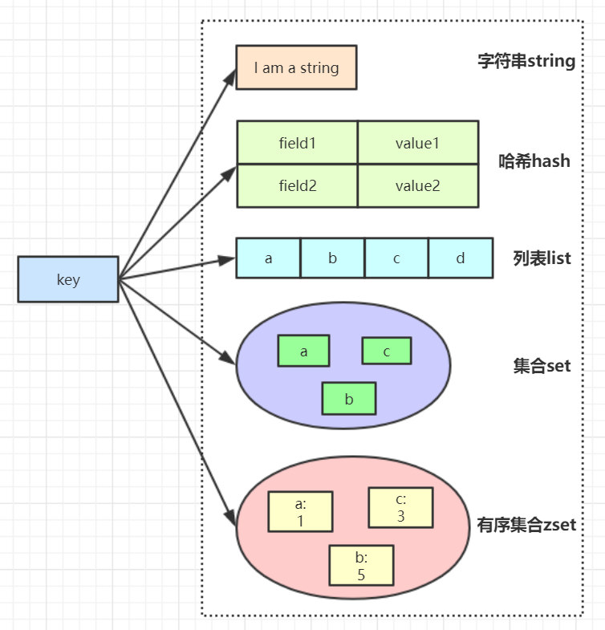

2.String结构

```java
字符串常用操作
SET  key  value       //存入字符串键值对
MSET  key  value [key value ...]   //批量存储字符串键值对
SETNX  key  value     //存入一个不存在的字符串键值对
GET  key       //获取一个字符串键值
MGET  key  [key ...]     //批量获取字符串键值
DEL  key  [key ...]     //删除一个键
EXPIRE  key  seconds     //设置一个键的过期时间(秒)

原子加减
INCR  key       //将key中储存的数字值加1
DECR  key       //将key中储存的数字值减1
INCRBY  key  increment     //将key所储存的值加上increment
DECRBY  key  decrement   //将key所储存的值减去decrement

场景应用
单值缓存
SET  key  value   
GET  key   

对象缓存
1) SET  user:1  value(json格式数据)
2) MSET  user:1:name  zhuge   user:1:balance  1888
    MGET  user:1:name   user:1:balance 
分布式锁
SETNX  product:10001  true     //返回1代表获取锁成功
SETNX  product:10001  true     //返回0代表获取锁失败
。。。执行业务操作
DEL  product:10001      //执行完业务释放锁

SET product:10001 true  ex  10  nx  //防止程序意外终止导致死锁

计数器
INCR article:readcount:{文章id}    
GET article:readcount:{文章id} 

Web集群session共享
spring session + redis实现session共享

分布式系统全局序列号  
INCRBY  orderId  1000    //redis批量生成序列号提升性能


```

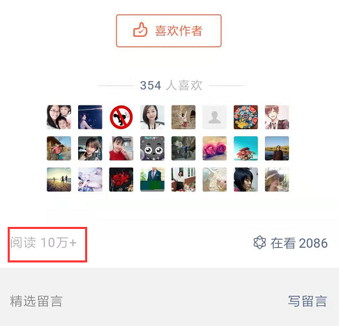


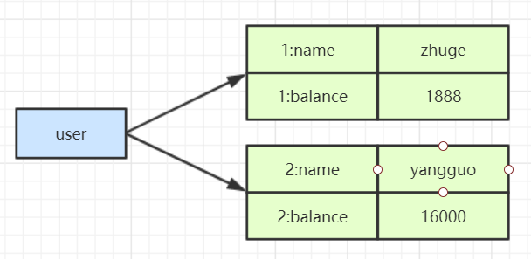

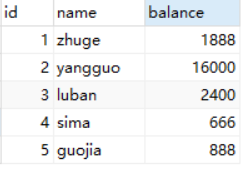

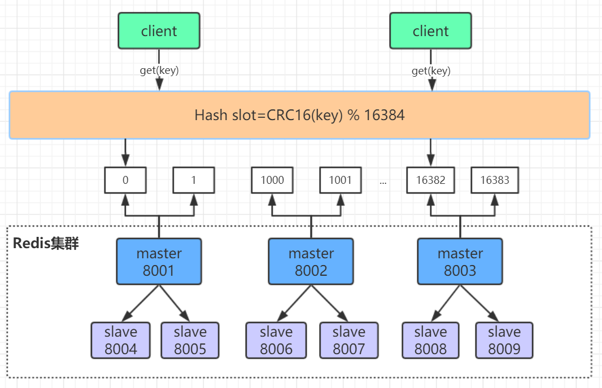

3.Hash结构

```java
Hash常用操作
HSET  key  field  value       //存储一个哈希表key的键值
HSETNX  key  field  value     //存储一个不存在的哈希表key的键值
HMSET  key  field  value [field value ...]   //在一个哈希表key中存储多个键值对
HGET  key  field         //获取哈希表key对应的field键值
HMGET  key  field  [field ...]     //批量获取哈希表key中多个field键值
HDEL  key  field  [field ...]     //删除哈希表key中的field键值
HLEN  key        //返回哈希表key中field的数量
HGETALL  key        //返回哈希表key中所有的键值

HINCRBY  key  field  increment     //为哈希表key中field键的值加上增量increment

对象缓存
HMSET  user  {userId}:name  zhuge  {userId}:balance  1888
HMSET  user  1:name  zhuge  1:balance  1888
HMGET  user  1:name  1:balance  

应用场景
电商购物车
1）以用户id为key
2）商品id为field
3）商品数量为value

购物车操作
添加商品hset cart:1001 10088 1
增加数量hincrby cart:1001 10088 1
商品总数hlen cart:1001
删除商品hdel cart:1001 10088
获取购物车所有商品hgetall cart:1001

hash结构优缺点
优点
1）同类数据归类整合储存，方便数据管理
2）相比string操作消耗内存与cpu更小
3）相比string储存更节省空间

缺点
过期功能不能使用在field上，只能用在key上
Redis集群架构下不适合大规模使用


```

4.List结构

```java
List常用操作
LPUSH  key  value [value ...]     //将一个或多个值value插入到key列表的表头(最左边)
RPUSH  key  value [value ...]     //将一个或多个值value插入到key列表的表尾(最右边)
LPOP  key      //移除并返回key列表的头元素
RPOP  key      //移除并返回key列表的尾元素
LRANGE  key  start  stop    //返回列表key中指定区间内的元素，区间以偏移量start和stop指定

BLPOP  key  [key ...]  timeout  //从key列表表头弹出一个元素，若列表中没有元素，阻塞等待          timeout秒,如果timeout=0,一直阻塞等待
BRPOP  key  [key ...]  timeout   //从key列表表尾弹出一个元素，若列表中没有元素，阻塞等待          timeout秒,如果timeout=0,一直阻塞等待

List应用场景
常用数据结构
Stack(栈) = LPUSH + LPOP
Queue(队列）= LPUSH + RPOP
Blocking MQ(阻塞队列）= LPUSH + BRPOP


微博消息和微信公号消息
诸葛老师关注了MacTalk，备胎说车等大V
1）MacTalk发微博，消息ID为10018
LPUSH  msg:{诸葛老师-ID}  10018
2）备胎说车发微博，消息ID为10086
LPUSH  msg:{诸葛老师-ID} 10086
3）查看最新微博消息
LRANGE  msg:{诸葛老师-ID}  0  4

```

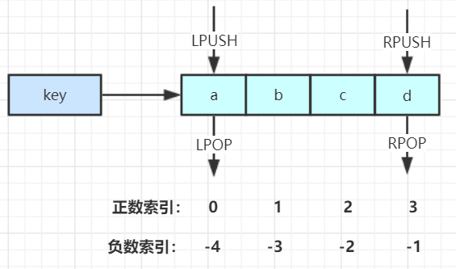

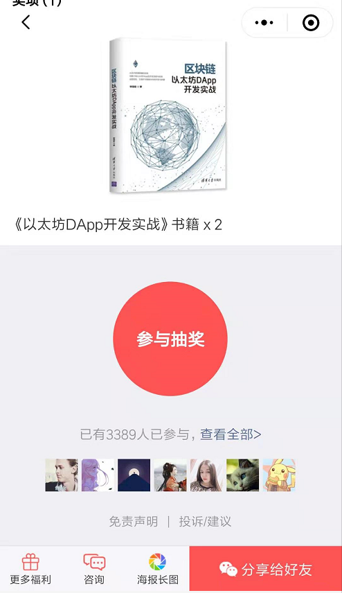


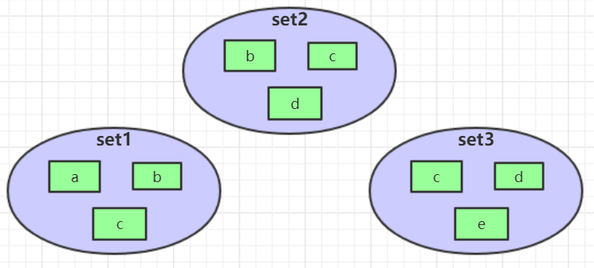


5.Set结构

```java
Set常用操作
SADD  key  member  [member ...]      //往集合key中存入元素，元素存在则忽略，
              若key不存在则新建
SREM  key  member  [member ...]      //从集合key中删除元素
SMEMBERS  key          //获取集合key中所有元素
SCARD  key          //获取集合key的元素个数
SISMEMBER  key  member      //判断member元素是否存在于集合key中
SRANDMEMBER  key  [count]      //从集合key中选出count个元素，元素不从key中删除
SPOP  key  [count]        //从集合key中选出count个元素，元素从key中删除

Set运算操作
SINTER  key  [key ...]         //交集运算
SINTERSTORE  destination  key  [key ..]    //将交集结果存入新集合destination中
SUNION  key  [key ..]         //并集运算
SUNIONSTORE  destination  key  [key ...]    //将并集结果存入新集合destination中
SDIFF  key  [key ...]         //差集运算
SDIFFSTORE  destination  key  [key ...]    //将差集结果存入新集合destination中


Set应用场景
微信抽奖小程序
1）点击参与抽奖加入集合
SADD key {userlD}
2）查看参与抽奖所有用户
SMEMBERS key    
3）抽取count名中奖者
SRANDMEMBER key [count] / SPOP key [count]

微信微博点赞，收藏，标签
1) 点赞
SADD  like:{消息ID}  {用户ID}
2) 取消点赞
SREM like:{消息ID}  {用户ID}
3) 检查用户是否点过赞
SISMEMBER  like:{消息ID}  {用户ID}
4) 获取点赞的用户列表
SMEMBERS like:{消息ID}
5) 获取点赞用户数 
SCARD like:{消息ID}


集合操作

SINTER set1 set2 set3  { c }
SUNION set1 set2 set3  { a,b,c,d,e }
SDIFF set1 set2 set3  { a }

应用场景
集合操作实现微博微信关注模型
1) 诸葛老师关注的人: 
zhugeSet-> {guojia, xushu}
2) 杨过老师关注的人:
 yangguoSet--> {zhuge, baiqi, guojia, xushu}
3) 郭嘉老师关注的人: 
guojiaSet-> {zhuge, yangguo, baiqi, xushu, xunyu)
4) 我和杨过老师共同关注: 
SINTER zhugeSet yangguoSet--> {guojia, xushu}
5) 我关注的人也关注他(杨过老师): 
SISMEMBER guojiaSet yangguo 
SISMEMBER xushuSet yangguo
6) 我可能认识的人: 
SDIFF yangguoSet zhugeSet->(zhuge, baiqi}

集合操作实现电商商品筛选
SADD  brand:huawei  P40
SADD  brand:xiaomi  mi-10
SADD  brand:iPhone iphone12
SADD os:android  P40  mi-10
SADD cpu:brand:intel  P40  mi-10
SADD ram:8G  P40  mi-10  iphone12

SINTER  os:android  cpu:brand:intel  ram:8G   {P40，mi-10}


```

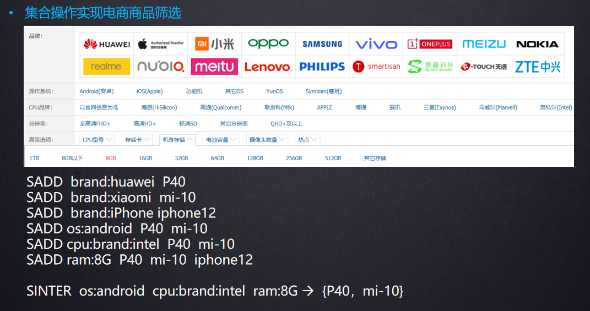

6.ZSet有序集合结构

```java
;ZSet常用操作
ZADD key score member [[score member]…]  //往有序集合key中加入带分值元素
ZREM key member [member …]    //从有序集合key中删除元素
ZSCORE key member       //返回有序集合key中元素member的分值
ZINCRBY key increment member    //为有序集合key中元素member的分值加上increment 
ZCARD key        //返回有序集合key中元素个数
ZRANGE key start stop [WITHSCORES]  //正序获取有序集合key从start下标到stop下标的元素
ZREVRANGE key start stop [WITHSCORES]  //倒序获取有序集合key从start下标到stop下标的元素

Zset集合操作
ZUNIONSTORE destkey numkeys key [key ...]   //并集计算
ZINTERSTORE destkey numkeys key [key …]  //交集计算

应用场景
Zset集合操作实现排行榜
1）点击新闻
ZINCRBY  hotNews:20190819  1  守护香港
2）展示当日排行前十
ZREVRANGE  hotNews:20190819  0  9  WITHSCORES 
3）七日搜索榜单计算
ZUNIONSTORE  hotNews:20190813-20190819  7 
hotNews:20190813  hotNews:20190814... hotNews:20190819
4）展示七日排行前十
ZREVRANGE hotNews:20190813-20190819  0  9  WITHSCORES





```

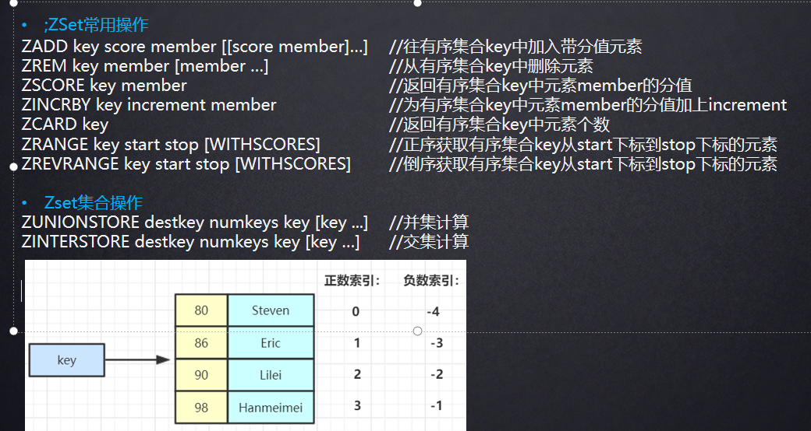

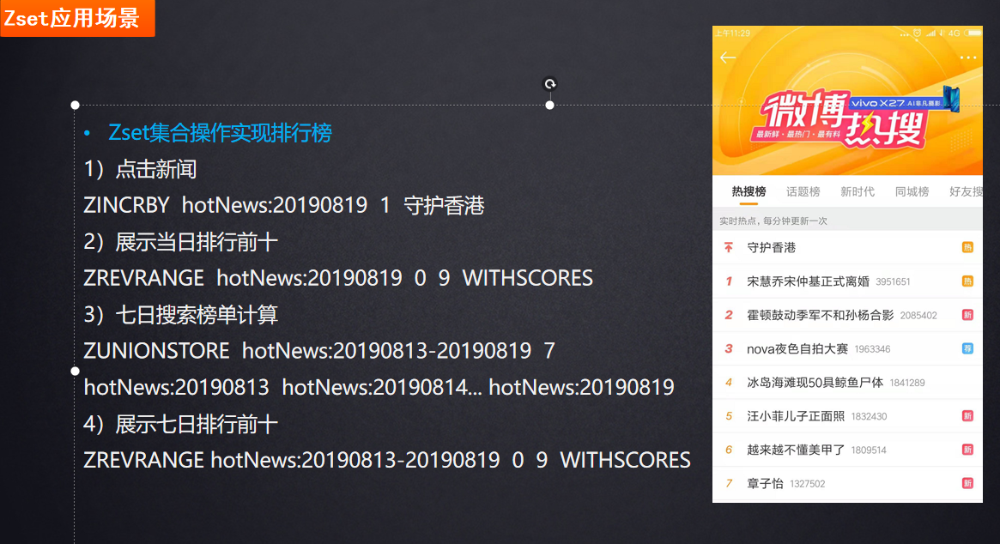

[Redis文章](Redis文章/Redis文章.md "Redis文章")
