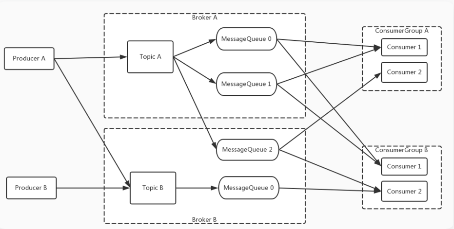
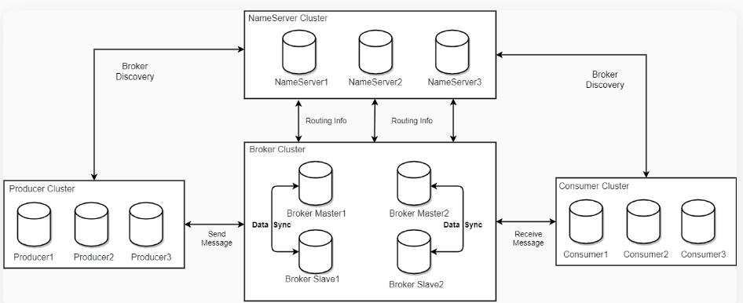

# 初识RoketMQ

# RocketMQ消息转发模型

这一部分我们可以结合一下管理控制台，先来理解下RocketMQ的一些重要的基础概念：

## 1. 消息模型

### 2. 部署模型

**RocketMQ主要由 Producer、Broker、Consumer 三部分组成，**

其中Producer 负责生产消息，Consumer 负责消费消息，Broker 负责存储消息。

Broker 在实际部署过程中对应一台服务器，每个 Broker 可以存储多个Topic的消息，每个Topic的消息也可以分片存储于不同的 Broker。Message Queue 用于存储消息的物理地址，每个Topic中的消息地址存储于多个 Message Queue 中。ConsumerGroup 由多个Consumer 实例构成。

### 生产者

发布消息的角色。Producer通过 MQ 的负载均衡模块选择相应的 Broker 集群队列进行消息投递，投递的过程支持快速失败和重试。

负责生产消息，一般由业务系统负责生产消息。一个消息生产者会把业务应用系统里产生的消息发送到broker服务器。RocketMQ提供多种发送方式，同步发送、异步发送、顺序发送、单向发送。同步和异步方式均需要Broker返回确认信息，单向发送不需要。生产者中，会把同一类Producer组成一个集合，叫做生产者组。同一组的Producer被认为是发送同一类消息且发送逻辑一致

### 消费者

负责消费消息，一般是后台系统负责异步消费。一个消息消费者会从Broker服务器拉取消息、并将其提供给应用程序。从用户应用的角度而言提供了两种消费形式：拉取式消费、推动式消费。

-   拉取式消费的应用通常主动调用Consumer的拉消息方法从Broker服务器拉消息、主动权由应用控制。一旦获取了批量消息，应用就会启动消费过程。
-   推动式消费模式下Broker收到数据后会主动推送给消费端，该消费模式一般实时性较高。

    消费者同样会把同一类Consumer组成一个集合，叫做消费者组，这类Consumer通常消费同一类消息且消费逻辑一致。消费者组使得在消息消费方面，实现负载均衡和容错的目标变得非常容易。要注意的是，消费者组的消费者实例必须订阅完全相同的Topic。RocketMQ 支持两种消息模式：集群消费（Clustering）和广播消费（Broadcasting）。
-   集群消费模式下, 相同Consumer Group的每个Consumer实例平均分摊消息。
-   广播消费模式下，相同Consumer Group的每个Consumer实例都接收全量的消息。

### 主题（Topic）

表示一类消息的集合，每个主题包含若干条消息，每条消息只能属于一个主题，是RocketMQ进行消息订阅的基本单位。

Topic只是一个逻辑概念，并不实际保存消息。同一个Topic下的消息，会分片保存到不同的Broker上，而每一个分片单位，就叫做MessageQueue。MessageQueue是一个具有FIFO特性的队列结构，生产者发送消息与消费者消费消息的最小单位。

### 代理服务器（Broker Server）

消息中转角色，负责存储消息、转发消息。代理服务器在RocketMQ系统中负责接收从生产者发送来的消息并存储、同时为消费者的拉取请求作准备。代理服务器也存储消息相关的元数据，包括消费者组、消费进度偏移和主题和队列消息等。

Broker Server是RocketMQ真正的业务核心，包含了多个重要的子模块：

-   Remoting Module：整个Broker的实体，负责处理来自clients端的请求。
-   Client Manager：负责管理客户端(Producer/Consumer)和维护Consumer的Topic订阅信息
-   Store Service：提供方便简单的API接口处理消息存储到物理硬盘和查询功能。
-   HA Service：高可用服务，提供Master Broker 和 Slave Broker之间的数据同步功能。
-   Index Service：根据特定的Message key对投递到Broker的消息进行索引服务，以提供消息的快速查询。

而Broker Server要保证高可用需要搭建主从集群架构。RocketMQ中有两种Broker架构模式：

-   普通集群：

这种集群模式下会给每个节点分配一个固定的角色，master负责响应客户端的请求，并存储消息。slave则只负责对master的消息进行同步保存，并响应部分客户端的读请求。消息同步方式分为同步同步和异步同步。

这种集群模式下各个节点的角色无法进行切换，也就是说，master节点挂了，这一组Broker就不可用了。

-   Dledger高可用集群：

Dledger是RocketMQ自4.5版本引入的实现高可用集群的一项技术。这个模式下的集群会随机选出一个节点作为master，而当master节点挂了后，会从slave中自动选出一个节点升级成为master。

Dledger技术做的事情：1、从集群中选举出master节点 2、完成master节点往slave节点的消息同步。

### 名字服务（Name Server）

名称服务充当路由消息的提供者。Broker Server会在启动时向所有的Name Server注册自己的服务信息，并且后续通过心跳请求的方式保证这个服务信息的实时性。生产者或消费者能够通过名字服务查找各主题相应的Broker IP列表。多个Namesrv实例组成集群，但相互独立，没有信息交换。

这种特性也就意味着NameServer中任意的节点挂了，只要有一台服务节点正常，整个路由服务就不会有影响。当然，这里不考虑节点的负载情况。

### 消息（Message）

消息系统所传输信息的物理载体，生产和消费数据的最小单位，每条消息必须属于一个主题Topic。RocketMQ中每个消息拥有唯一的Message ID，且可以携带具有业务标识的Key。系统提供了通过Message ID和Key查询消息的功能。

并且Message上有一个为消息设置的标志，Tag标签。用于同一主题下区分不同类型的消息。来自同一业务单元的消息，可以根据不同业务目的在同一主题下设置不同标签。标签能够有效地保持代码的清晰度和连贯性，并优化RocketMQ提供的查询系统。消费者可以根据Tag实现对不同子主题的不同消费逻辑，实现更好的扩展性。
